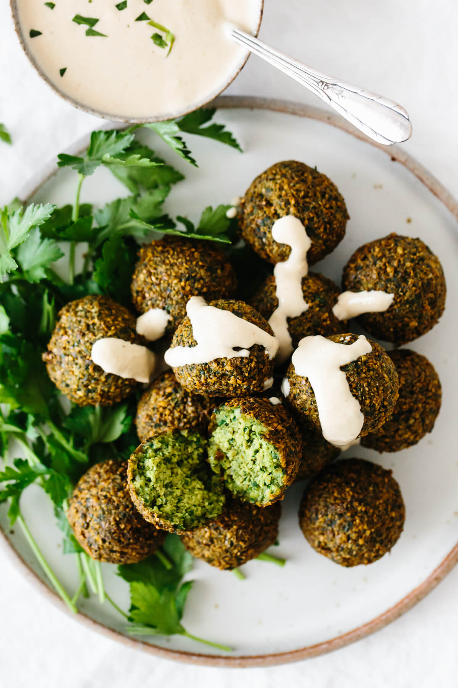
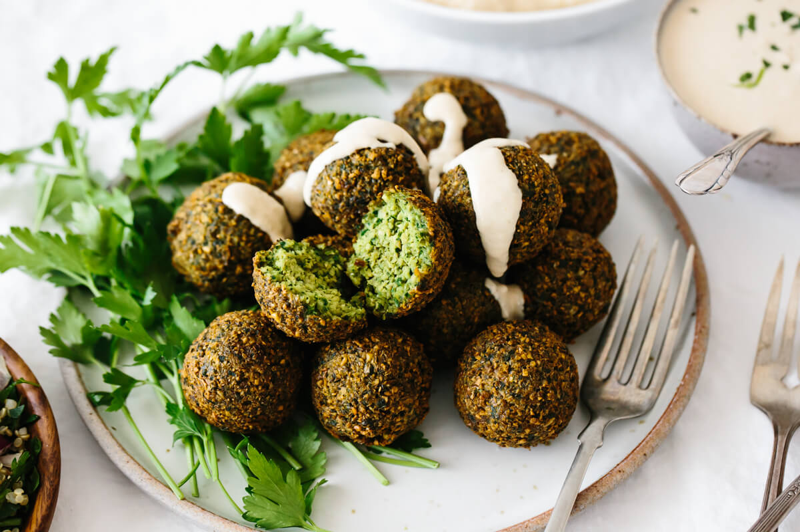
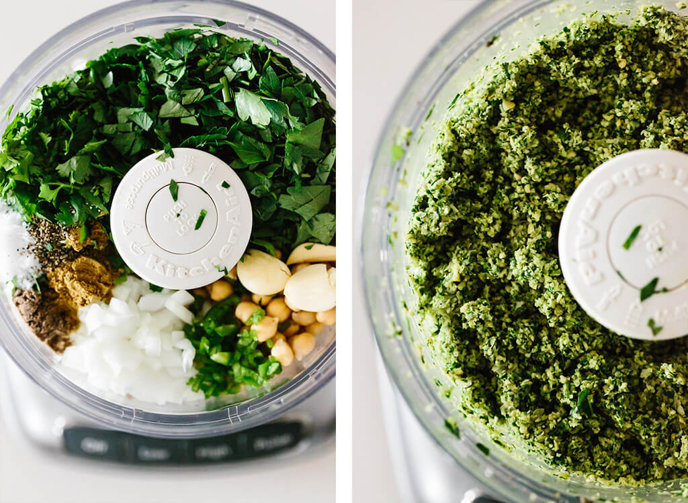

# Most Delicious Falafel
Falafel are delicious balls of chickpea and herb goodness that you find in Middle Eastern cooking. Naturally vegan and vegetarian, falafel are great in wraps, pitas, sandwiches and salads. Today, I’ll share how to make both fried falafel and baked falafel. You choose your favorite!

**A plate of falafel drizzled with tahini sauce.**

**Are you ready for the best falafel you’ve ever tasted?** I’ve had my fair share of falafel on travels through Egypt, Israel and Jordan. I’ve had them in restaurants and on street corners (about as authentic as they come). I’ve had them stuffed in gluten-free pita and on salads. And I’ve had them with slight variations and tweaks, though the recipe itself is fairly simple.

But after eating my way through Tel Aviv last year, I realized what makes the best falafel. And here’s the answer: tons of herbs (double the normal amount) and a small amount of green pepper. This makes for an addictive flavor that’s “a little something extra” but not spicy. Just insanely delicious.

**WHAT IS FALAFEL?**
Traditional falafel is made from ground chickpeas or fava beans, herbs and spices. The mixture is then formed into balls or patties and deep fried for a texture that’s crispy on the outside and soft on the inside, sort of like a fritter. It’s a classic Middle Eastern and Mediterranean recipe that’s enjoyed as street food and often served up as part of mezze (a group of small meals).

**FALAFEL INGREDIENTS**
Falafel are naturally gluten-free and made from a few simple ingredients. Here’s what’s in my recipe:

**Chickpeas** (Garbanzo Beans): Only use dried and soaked chickpeas, not canned chickpeas in this recipe. Canned chickpeas will be too soft and wet and your falafel will not form properly.
**Onion:** I use yellow onion for a slightly stronger flavor, but you could use white or red onion as well.
**Parsley and Cilantro:** These two delicious herbs inject heaps of flavor into your falafel and turn the inside a beautiful, vibrant green.
**Garlic:** Use fresh garlic cloves rather than garlic powder for the most robust flavor.
**Green Chile Pepper** (Serrano Pepper): A small pepper adds a kick of flavor and spice without over-powering the falafel. You can adjust this to more or less, but don’t omit it without trying it first – trust me.
Cumin, Cardamom, Salt and Black Pepper: These aromatic spices are used often in Middle Eastern cooking and have an earthy, spicy, assertive flavor you’ll love.
**Chickpea Flour:** This helps to bind the mixture together and retain the shape while frying. I prefer chickpea flour, but you could also use a gluten-free flour blend.
**Baking Soda:** A key ingredient for helping to provide the fluffy inside texture of the falafel.
**Oil for Frying:** I use avocado oil as it’s high-heat stable and my preferred cooking oil. But you could use vegetable oil as well.
*Note: While this recipe is gluten-free and all falafel I’ve had overseas have been made with gluten-free ingredients, always double check the flour used and if there’s cross-contamination with the oil. 

**How to make falafel in a food processor.**

Scooped falafel mixture ready to be cooked.

**HOW TO MAKE THE BEST FALAFEL (AT HOME!)**

Are you ready to make homemade falafel? Great! Let’s break this into two parts – making the dough and then cooking (so you can choose your preferred cooking method).

**HOW TO MAKE THE FALAFEL DOUGH MIXTURE**
Soak your dried chickpeas. Overnight or for at least 8-12 hours. Note that the chickpeas will triple in size, so cover them with plenty of water. Then drain and rinse them.
Add all the ingredients to a food processor. Add the chickpeas, onion, parsley, cilantro, garlic, green pepper and spices to a food processor. I recommend roughly chopping up the onion, herbs and pepper before adding. Pulse the food processor but do not blend completely. The final mixture should resemble coarse sand.
Transfer the mixture to a bowl. Then add the chickpea flour and baking soda, stir it together until it’s fully combined and cover with plastic wrap or a lid.
Place the bowl in the fridge. Chill the falafel mixture for 30 minutes to 1 hour.
Shape your falafel. You can do this by hand, with a cookie scoop (which is what I use) or a falafel scoop. Decide if you’d like round balls or flatter patty shapes. The flatter shapes are better if you plan to pan fry or bake. Any shape can be used for deep frying. Form all your falafel and place on a plate.
A plate of falafel with one cut open in half.

**HOW TO COOK FALAFEL – 3 DIFFERENT WAYS**

How to Deep Fry Falafel: Heat about 3 inches of oil (I use avocado oil) in a pot on medium heat to 350F. Once the oil has reached temperature, gently drop 6-8 balls into the oil at a time. Let them cook for 1-2 minutes or until golden on the outside. Use a skimmer to the remove the falafel to a paper towel-lined plate.

How to Pan Fry Falafel: Heat a few tablespoons of oil in a pan (I prefer cast iron) on medium-high heat. Gently place the falafel in the pan and cook each side for 2-3 minutes or until golden, then transfer to a paper towel-lined plate.

How to Bake Falafel: Pre-heat your oven to 425F. Lightly spray or brush a baking sheet with oil. Place the falafel on the baking sheet, lightly spray or brush the top side with oil and bake for 25-30 minutes, flipping halfway through. You can also bake them on parchment paper or a silicone mat without any oil. They’ll just be slightly less crispy and golden.

You’ll notice in the photo below that no matter which method you choose, they look pretty similar once cooked. A perfectly golden outside and bright green inside!

Want to know the method I use most often? If it’s just for me, I’ll pan fry. It uses less oil but is still super crispy on the outside. If it’s for a party or guests, I love the balls. They’re the perfect finger food!

How to cook falafel three different ways, deep fried, pan fried and baked.

**HOW TO SERVE FALAFEL**

Falafel are best served immediately after cooking, so they’re warm and crispy. They’re delicious served in gluten-free pita, wrapped in lettuce or collard greens or topped on a simple green salad (my preferred method). But however you serve them, don’t forget to drizzle them with Tahini Sauce. It’s a creamy and flavorful requirement!
